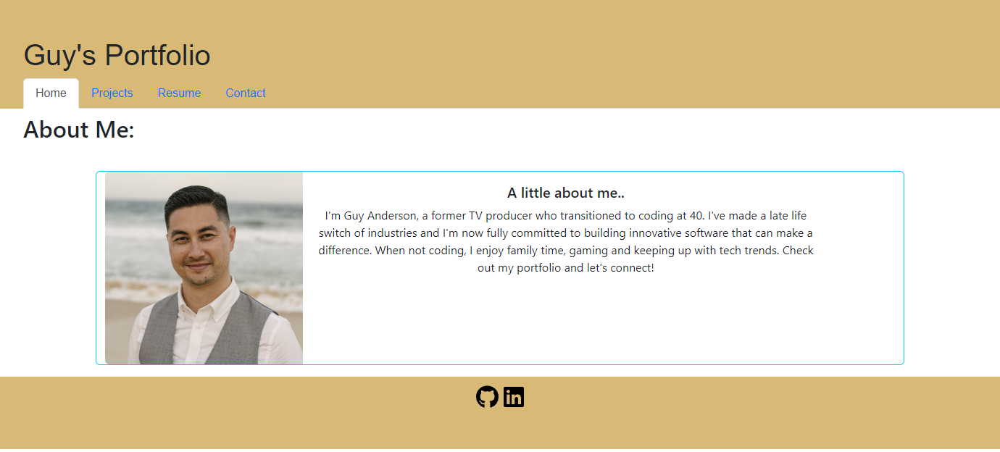

# E-Commerce Backend

  

  ## Description
Professional portfolio built using React.

  ## Table of Contents

  * [License](#license)
  * [Questions](#questions)
  * [Screnshot](#screenshot)
  
  ## License
  - MIT
  - https://choosealicense.com/licenses/MIT/
  - A short and simple permissive license with conditions only requiring preservation of copyright and license notices. Licensed works, modifications, and larger works may be distributed under different terms and without source code.
  

  ## Questions

  If you have any questions or require further information, please contact me at:

  - GitHub: https://github.com/GuyJiawei
  - Email: guy.jiawei.anderson@gmail.com

  ## Screenshot

